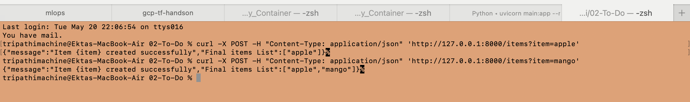

# Get Start
Install below libraries / packages under new Virtual Env

```bash
cd /Users/tripathimachine/Desktop/Apps/GitHub_Repo

python3 -m venv .venv-fastapi

source .venv-fastapi/bin/activate

pip freeze

python --version

pip install pydantic fastapi uvicorn pandas numpy

python -c "import pydantic; print(pydantic.VERSION)"

pip freeze
```

We need to install both FastAPI and Uvicorn. 
Uvicorn is going to be the server that we use to test and run our FastAPI applications.
 
- Once installed, create a new directory for your project.
- Open this directory in your code editor and create a file called `main.py`.
- In your `main.py` file, import FastAPI and then use it to create a new app. [Refer sample code](./01-sample-app/main_app.py)
- To run your server, go back to terminal and then use Uvicorn. [Follow steps](#how-to-run)
- So now we have a really basic app working. Lets figure out how we can [add routes](#creating-routes) to our application. 


# How to Run
To run your server, navigate to Terminal and then use Uvicorn command as below.

```bash
uvicorn <file_name>:app --reload

# Sample: considering the file name is main.py
uvicorn main:app --reload

# When the file name is main_app.py
uvicorn main_app:app --reload

# Kill the process for "ERROR:    [Errno 48] Address already in use"
sudo lsof -t -i :8000 | xargs sudo kill -9 
```

[FastAPI Doc - First Step](https://fastapi.tiangolo.com/tutorial/first-steps/)

```bash
fastapi dev main.py
```


# Creating Routes
Routes are going to be a URL when you enter a different thing. For example, you want to see items or you want to see a user like "http://127.0.0.1:8000/items" or "http://127.0.0.1:8000/users". This is a route.

In FastAPI, routes are used to define the different URLs that your app should respond to. You can create routes to handle different interactions. 

Refer [To-Do]() Application for code example.


# Test Routes
To test the Routes, open up a new terminal and then send the below curl request directly to our URL.
Make sure in Terminal-1 the app is running, and testing is done from Terminal-2.

```bash
curl -X POST -H "Content-Type: application/json" 'http://127.0.0.1:8000/items?item=apple'
```


Get Selected Item
```bash
curl -X GET http://127.0.0.1:8000/items/0

```

Get Item(s)
```bash
curl -X GET 'http://127.0.0.1:8000/items?limit=3
```

# Activate Virtual Env

```bash
cd /Users/tripathimachine/Desktop/Apps/GitHub_Repo

source .venv-fastapi/bin/activate

cd Python-Playground/Fast-Api
```

# Handling HTTP Errors
**HTTP Response Status Codes**

HTTP response status codes indicates whether a specific HTTP request has been successfully completed. Responses are grouped in five classes:
- Informational Responses (100 - 199)
- Successful Responses (200 - 299)
- Redirection Messages (300 - 399)
- Client Error Responses (400 - 499)
- Server Error Responses (500 - 599)


# Using Pydantic
Make changes [Refer Code](./03-To-Do-2/main.py)

When using pydantic, we have to provide the agrument in JSON payload as a request instead of query parameter, as we are using Modeled Object like "ItemCls" from the code example.

```bash
curl -X POST -H "Content-Type: application/json" -d '{"text":"apple"}' 'http://127.0.0.1:8000/items'

```


# FastAPI Interactive Documentation
Whenever you start a FastAPI server, you get a documentation page for free that you can actually interact with and use to test your API's.

So far we've been doing all our testing in the terminal, but it can be pretty hard to type out the commands oevr and over again or to make modifications to it.  

Go back to our local FastAPI Server "http://127.0.0.1:8000" and then add this "/docs" to the end of your URL as "http://127.0.0.1:8000/docs", youll get taken to this Swagger UI page where you get to see all of your endpoints. You get to see which HTTP method they accept, and if you click into them, you can also look at the type of parameters they take. 

Also if you type in "/redoc" instead as the path, you get other set of documentation. 
