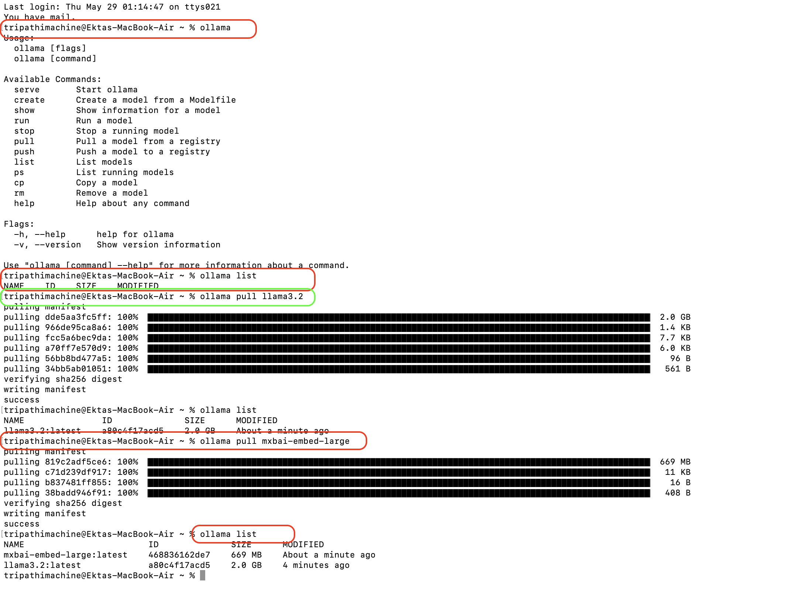

# Learning to build local AI Agent

Will be using Python, Ollama, LangChain & ChromaDB (as our vector search database) to build our own local AI Agent.

And finally add RAG with this App, to retrive something relevant information from something like CSV file or PDF and bring that into our model.

## Project Setup
- A CSV file for fake-reviews.
- CSV File has "Title, Date, Rating, Review" as fields.
- Create Virtual Environment for this project.

```bash
cd /Users/tripathimachine/Desktop/Apps/GitHub_Repo/Python-Playground/Local-AI-Agent

python3 -m venv aiagent-venv

source aiagent-venv/bin/activate

pip3 install -r requirements.txt
```
- Ollama Setup
Ollama allows us to run models locally on our own computer using our own hardware. So that we should be able to do everything locally here, rather than having to use something like an Open AI API key. 

To download navigate to [ollama site](https://ollama.com/download) to download select appropitate OS.

Once download is complete, double click on the downloaded .zip file and install Ollama. 

Next open up the terminal (seprate terminal) and type the command `ollama` to ensure it downloaded properly and is accessible. This should print usage and available commands of Ollama.

[Refer Video for details on how to install](https://www.youtube.com/watch?v=UtSSMs6ObqY)

To List all available models use command `ollama list` since we recently installed it wil be empty.

- Install Ollama Model
Ollama is just a open source software, and allows us to pull various models to out own computer and then run them using our onw hardware. Now depending on the type of hardware you have that will dictate the model we will be able to run.

As we are using regular laptop which usually does not have Graphics Card, and will have limited CPU and memory, so we have options of small models that we can download and use. 
To get the models refer [Ollama Library](https://ollama.com/library) will be using llama3.2 which is a smaller model and works pretty well and requires less memory.

Run the below command on the terminal-2 (not the virtual env., but the one where we ran ollama commands above.)

```bash
ollama pull llama3.2
```

This command will pull said model

- Embedding Model
Next model that we are going to pull is embedding model.

```bash
ollama pull mxbai-embed-large
```



- Start writing some code.
[Refer](main.py) for actual code.
Hwoever want to understand or to get start [Refer](./01_get_start.py)

Run the code `python3 main.py`

- Next is to set Vector Search.
Create another file [Vector](vector.py) which has the logic for actually embedding our documents, and then looking them up or vectorizing our documents.

Vector Search is a database, its gonnam be hosted locally on our own computer using something called ChromaDB. This is going to allow us to really quickly look up relevant information that we can then pass to our model, and then our model can use that data 
to give us some more contextual relevant replies. 

LLMs are really good at kind of synthesizing text and giving us responses but usually they dont have the correct data. So on this case what we are going to do is we are going to take the CSV file which we talked about initially, and put it inside of this vector enabled database. 
Then for any question asked will lookup the relevant documents in that database, as we will be passing it to the model as a list of reviews. 

Note: Remember to modify the [main.py](./main.py) to import the **vector.py** and to refer reviews from embeddings.


- Back to run the main.py using `python3 main.py`. Now as we have embeddings of the reviews, and also looping to ask as many questions. 


## Stop.
```bash
deactivate
```
and **quit ollama** (close the terminal / also check if llama icon is visible.. if so click and quit.)

