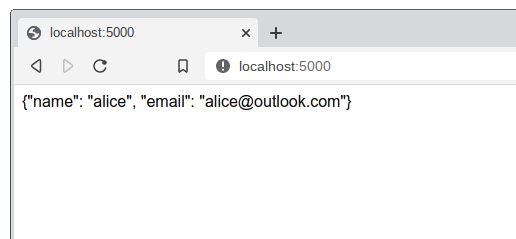
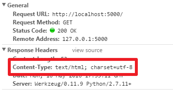
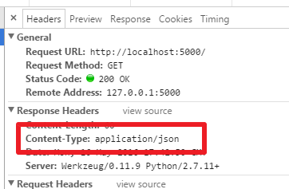

# Flask API Example
To make our first program, recall that we enter the URL in the browser

```localhost:5000```
At the time, a string “Hello World!” was returned, so we thought, can we replace this string with a json sequence? Isn’t that the same as a REST query API?

So, we might have the first impulse to do this:
```
#!/usr/bin/env python
# encoding: utf-8
import json
from flask import Flask
app = Flask(__name__)
@app.route('/')
def index():
    return json.dumps({'name': 'alice',
                       'email': 'alice@outlook.com'})
app.run()
```
Actually, we just modified the returned string, modified it to a string of JSON, and then we opened it on the browser.



Wow! It seems to have achieved the function we wanted, returned a JSON string.

But we opened the debug tool for Chrome (which I use as a tool similar to Chrome, Safari, Firefox) (under Windows: Ctrl + Alt + I, Mac under: Cmd + Shift + I), we can see that this returned data type actually is of type html:


*You may wonder what impact this might have, the impact should be small in most cases, but for some mobile-side libraries, the data may be processed according to the response (incorrectly!)*

*Return json*
To deal with this situation, we can’t simply set this response head into json format.
A better solution is to use the jsonify function of the Flask, where I use this function to modify the code:
```
#!/usr/bin/env python
# encoding: utf-8
import json
from flask import Flask, jsonify
app = Flask(__name__)
@app.route('/')
def index():
    return jsonify({'name': 'alice',
                    'email': 'alice@outlook.com'})

app.run()
```
The changes are:
```
from flask import ...., jsonify
... ...
    return jsonify({'name': 'alice',
                    'email': 'alice@outlook.com'})
```
Look at Google Dev Tools, you’ll see the content-type change to JSON.


