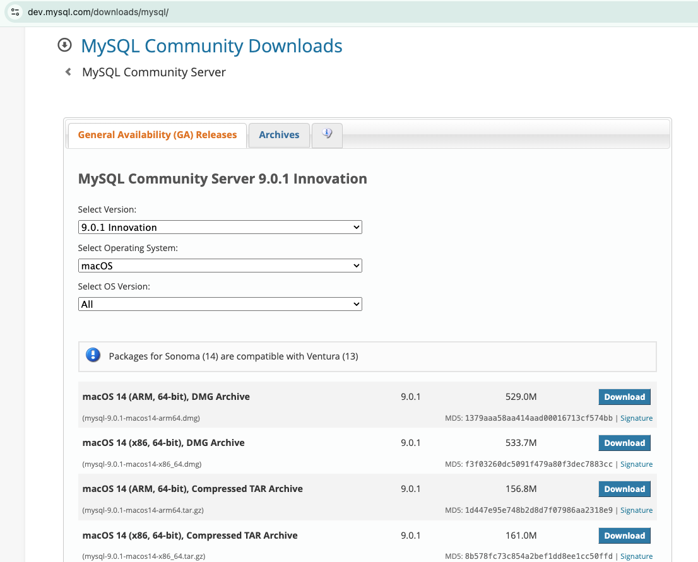
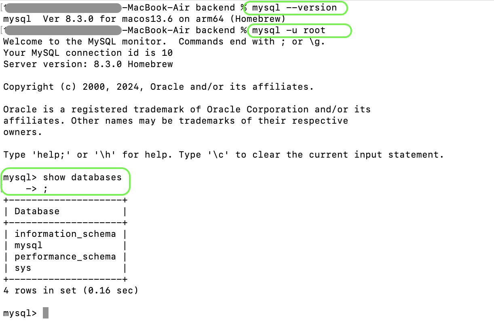

# MySQL Database

# Install MySQL on Mac using Installer
Before installing, make sure MySQL does not exists.

```bash
mysql --version
```
If above returns with the version of MySQL Database, it means it is already installed, and good to proceed.

If not follow below instruction.
1. Navigate to [Official site](https://www.mysql.com/downloads/)
2. Scroll to bottom to look for "MySQL COmmunity (GPL) Downloads", click on it.
3. Further from the various options, click on "MySQL COmmunity Server"
4. It will take you to the installer to downloads, for it will be something like 
   
5. Choose appropriate installer, Iam going with first option from above image.
    a. ARM, 64-bit --> Is for Mac with M1/M2 chip.
    b. x86, 64-bit --> is for Mac with Intel Chip.
6. Once download is complete, install by clicking next, and provide password where required.

# Install MySQL on Mac using Homebrew
1. `brew install mysql`
2. Note brew installs the MySQL databases withut a root passeord. To secure it run
```bash
mysql_secure_installation
```
It will prompt for password.
3. 

# Working on Terminal with MySQL
1. Connect to Terminal.
2. run below commands.
```bash
mysql --version
```
If you have provided the Password.
```bash
mysql -u root -p
```
Or if there is no password use below
```bash
mysql -u root
```
Check for all existing Databases.
```bash
show databases;
```

Create Database
```bash
create database demo;
```
Check Info on MySQL
```bash
brew info mysql

which mysql
```

# Working with Workbench
MySQL Workbench is a graphical user interface (GUI) tool used for creating, managing, and visualizing databases.

## TO install using Installer
To install from [installer](https://dev.mysql.com/downloads/workbench/#:~:text=MySQL%20Workbench%208.0.38)

https://formulae.brew.sh/cask/mysqlworkbench


## To install using Homebrew
CHeck if already installed.
```bash
brew list | grep mysqlworkbench
```
If result then we are good, meaning its installed.

Check if the MySQL Workbench is supported.
```bash
brew search mysqlworkbench

brew services list
brew search mysql
```
Should get the rsult with `Casks` section and have the `mysql workbench`.

Install workbench
```bash
brew install mysqlworkbench

# or
brew install --cask mysqlworkbench
```
Once installed, navigate to "Applications" directory and double click the MySQLWorkbench.


