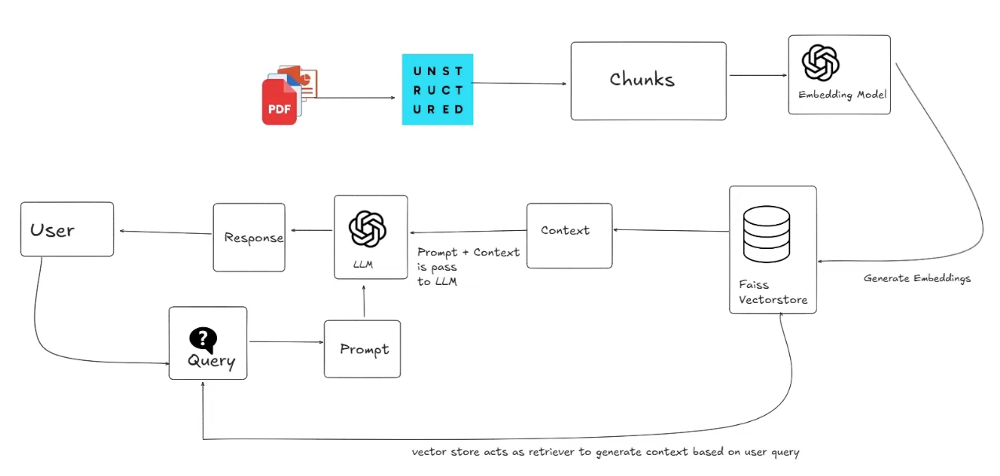

# RAG Chatbot for multiple document types

1. [rag.py](rag.py)
2. [requirements.txt](requirements.txt)
3. [env](.) # FOr storing secret or metadata. Such as OPENAI_KEY

Run as streamlit app `streamlit rag.py`
